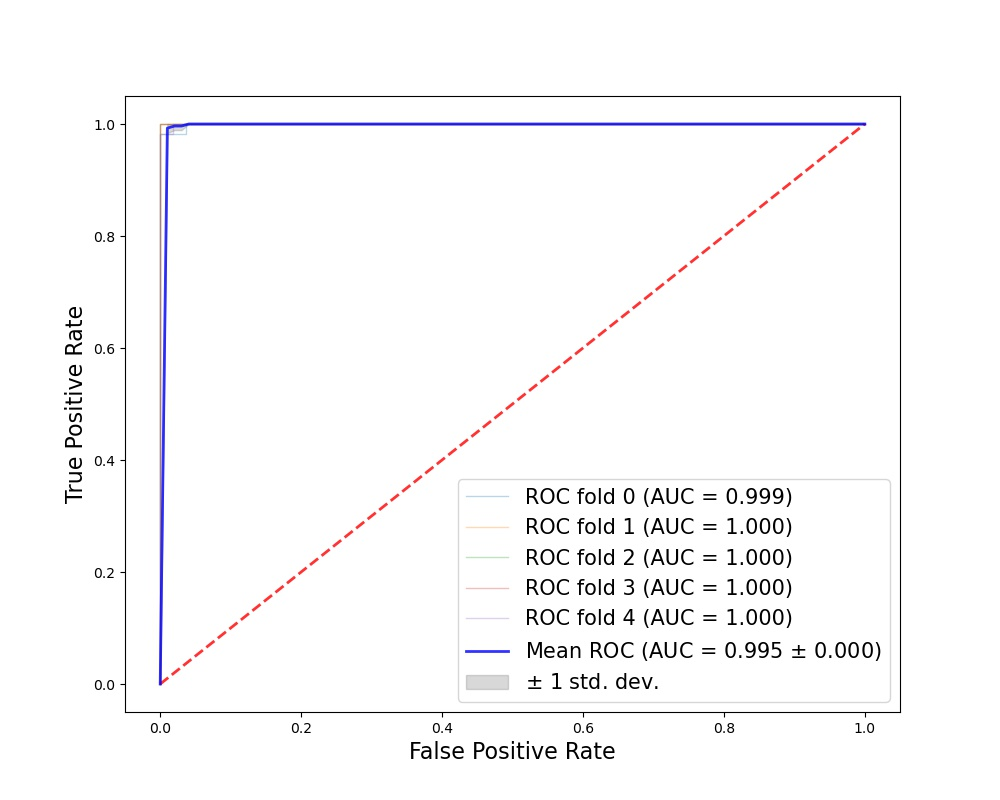
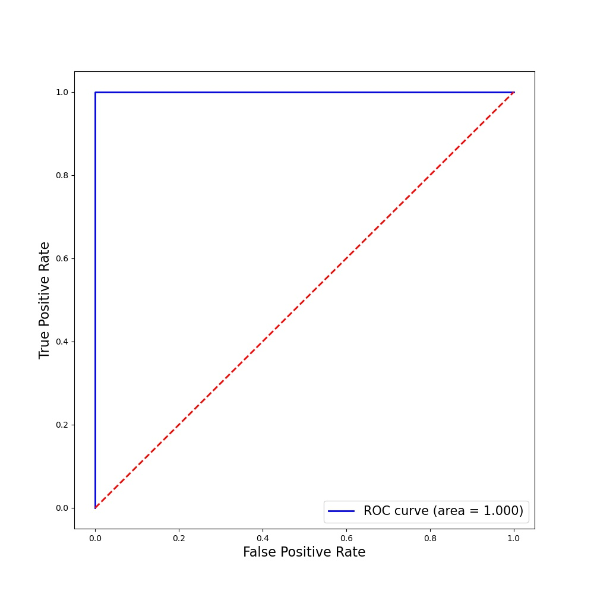
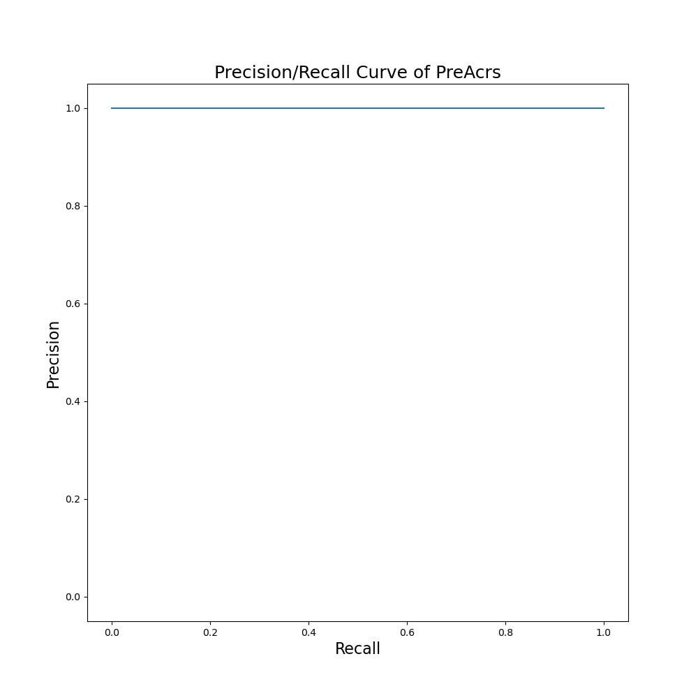

Anti-CRISPER Protein identification
===
Dataset collections
-------
## Train data

For positive samples, 480 experimental verified RGENs were collected from literature.
And by CD-HIT (setting 70% threshold), finally 389 RGENs samples were filtered.        
For negative samples, samples were collected based on the following criteria:
>* Must not be known or putative Class II effector proteins.
>* Must be isolated from phage or bacterial MGEs (known or putative MGEs).
>* must have < 40% sequence similarity to each other and the positive samples.

The composition of positive samples and negative samples are listed below.

* Positive samples 

`389 RNA guided endonuclease, RGENs (Cas9/Cas12/IscB/TnpB/Cas13)` 

* Negative samples

`719 Class II CRISPR-Cas accessory proteins / Class I CRIPSR-Case `

## Independent test data

Totally,102 positive samples were collected and the composition of negative samples are listed below.
>* BEST (18)  
>* Proteins to be validated (7)  
>* TnpB (59)  
>* Fanzor (11)  
>* Cas12n (7)  

Totally,330 negative samples were collected and the composition of negative samples are listed below.  

`Class II CRISPR-Cas accessory proteins / Class I CRIPSR-Cas`


Usages
-----
First, you need to download and prepare the data that you require form train data set. 
After preparing the features in training dataset, download the code folder. Before utilizing the python scripts, you need to input the corresponding positive samples file, negative samples file and feature name. For using the ESM feature, if you want to decide the columns of feature selections in advance, you also need to input in `mrmrK`.  

The output will contain:

* A matrix demonstrates validation performances of 5-fold cross validation. 

```
metrics_cols = ['PRE','REC','SPE','F1_score','ACC','MCC','AUC']
validation_performance=pd.DataFrame(per,columns=metrics_cols)
validation_performance.loc[5]=list(mean_per)
validation_performance.loc[6]=list(np.std(per,axis=0))
validation_performance.insert(0,'Category',['fold1','fold2','fold3','fold4','fold5','mean','std'])
```

* The ROC curve of the training dataset based on the result of cross validation.

```
ROC_5_fold(y_pred_valid_all,y_verified_valid_all,feature_name+'_ROC_5_fold.jpg')
```



* A matrix contains the result of the test performance.
```
test_performance=performance(test_data.iloc[:,0],test_pred_score)
test_metrics = {}
for i,v in enumerate(metrics_cols):
    test_metrics[v] = test_performance[i]
test_performance = pd.DataFrame.from_dict(test_metrics,orient='index').T
test_performance.to_csv(feature_name+'_Test_Performance.csv',index=None)
```

* The ROC curve of the test dataset.

```
auc_pred(list(test_pred_score),list(test_data.iloc[:,0]),feature_name+'_Test_ROC.jpg')
```


* The precision/recall curve.

```
pr_curve(list(test_pred_score),list(test_data.iloc[:,0]),feature_name+'_Test_PR_curve.jpg')
```



* The CSV file of predicted score.

```pred_test=pd.DataFrame({'Predict score':test_pred_score,'Verified':test_data.iloc[:,0]}).reset_index(drop=True)
pred_test.to_csv(feature_name+'_Test_Pred_Score.csv',index=None)

test_performance=performance(test_data.iloc[:,0],test_pred_score)
```


## Independent test set
You need to input the corresponding test data file, feature name and the direction path of the training model.

The output contains:

* The ROC image of the test dataset.

```
roc_curve(list(test_lable),list(pred_score))
```


* The precision/recall curve.

```
pr_curve(list(pred_score),list(test_lable),feature+'_PR_curve.jpg')
```


* The csv file of predicted score.

```
pred_score = np.mean(y_proba_all,axis=0)
pred_df = pd.DataFrame({'Predict score':pred_score,'Verified':test_lable})	
```

# Reference
Our work is based on the following literature.  
PreAcrs: a machine learning framework for identifying anti-CRISPR proteins. [https://doi.org/10.1186/s12859-022-04986-3]


